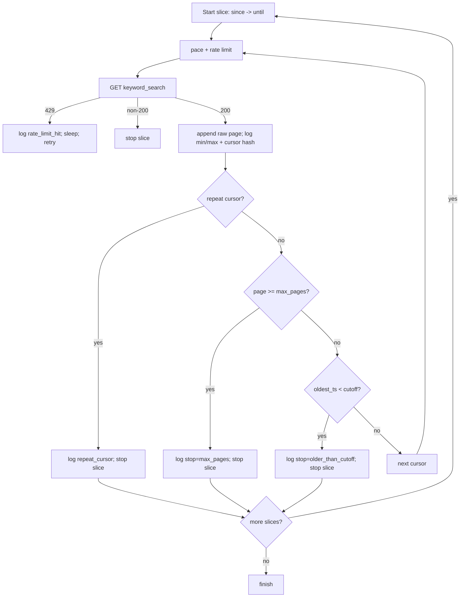

# Thread Keyword Search CLI (Threads API)

This project is a Python CLI to fetch Threads keyword search results, paginate safely, deduplicate items, and save raw page payloads for analysis. It includes safeguards for non-advancing cursors and rate limits, plus time-sliced crawling to cover older data.

## Quick Start

```bash
pip install -r requirements.txt

python3 fetch_threads.py \
  --keyword rolex \
  --since 1745359200 \
  --until 1778180936 \
  --limit 10 \
  --max-rps 2 \
  --burst 1 \
  --pretty \
  --output-dir .
```

Defaults:
- `--max-pages 100`
- `--step-back-hours 24` (time-sliced backward crawl with ID dedupe)
- Saves raw pages as NDJSON to `threads_YYYYMMDD_HHMMSS.json`; filtered results print to stdout.

## Key Behaviors
- Rate limiting with pacing logs (`sleep_ms=...`).
- Repeat-cursor detection and stop (`repeat_cursor cursor_hash=...`).
- Max-pages guard (`stop=max_pages`).
- Per-page diagnostics: `min_ts`, `max_ts`, `cursor_hash`.
- Time-sliced crawling via `--step-back-hours`; dedupes IDs across slices.
- Raw streaming: one page payload per line to the output file.

## Pagination Issue and Mitigations (Threads `keyword_search`)

Observed behavior:
- `paging.next` can repeat (no real cursor advancement), causing overlapping pages.
- Pages are not strictly chronological (relevance-ranked window); `min_ts`/`max_ts` bounce.

Safeguards implemented:
- Repeat-cursor stop with a logged `cursor_hash`.
- Max-pages guard (default `--max-pages 100`).
- Per-page diagnostics: `page, min_ts, max_ts, cursor_hash`.
- Time-sliced crawling (`--step-back-hours`, default 24) with cross-slice ID dedupe.
- Raw NDJSON streaming remains for debugging; filtered output stays on stdout.

Mermaid flow:


If cursors still loop, adjust knobs:
- Try smaller slices (e.g., `--step-back-hours 12`).
- Increase/decrease `--max-pages` per slice.
- Inspect raw NDJSON and logs for cursor repetition and timestamp overlap.

## Tests

```bash
pytest -v
```

## Documentation and Plans
- Design: `docs/superpowers/specs/2026-05-30-threads-keyword-search-design.md`
- Rate-limit design: `docs/superpowers/specs/2026-05-30-threads-rate-limit-optimization-design.md`
- Output file design: `docs/superpowers/specs/2026-05-30-threads-output-file-design.md`
- Raw output design: `docs/superpowers/specs/2026-05-30-threads-raw-output-design.md`
- Pagination issue report: `docs/superpowers/specs/2026-05-30-threads-pagination-issue.md`
- Plans: see `docs/superpowers/plans/` for implementation breakdowns.

## Notes
- The Threads `keyword_search` endpoint can return non-chronological, overlapping pages; client safeguards prevent infinite loops and surface diagnostics.
- Adjust `--step-back-hours` (e.g., 12) or `--max-pages` if you need different crawl behavior.
